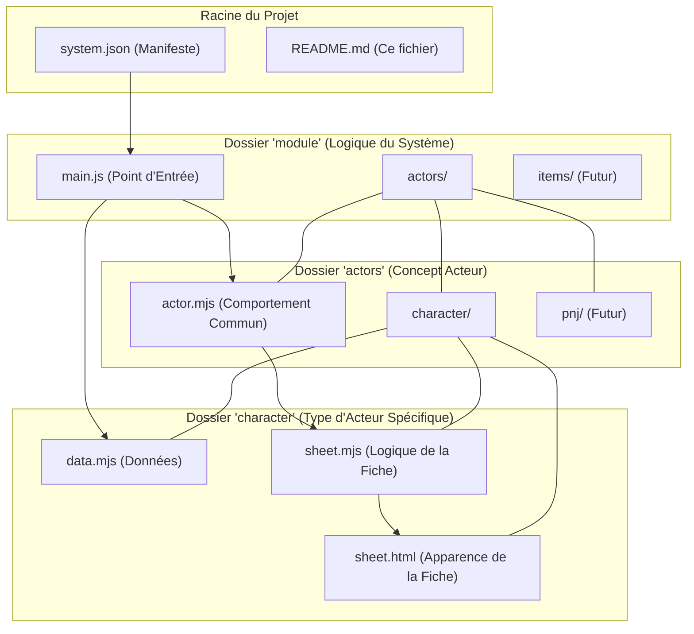

# Système de Jeu "Guildes : El Dorado" pour Foundry VTT

Ce dépôt contient le code source du système de jeu pour le jeu de rôle **Guildes : El Dorado**, développé pour la plateforme Foundry Virtual Tabletop (Version 13).

Ce projet est en cours de développement. L'objectif est de fournir une implémentation fidèle et ergonomique des règles du jeu pour faciliter les parties en ligne.

## 🏛️ Architecture du Système

Ce système adopte une architecture modulaire et orientée concept, conçue pour être claire, maintenable et extensible. La structure des fichiers clés est la suivante :



### Description des Composants

*   **`system.json`**: Le manifeste du système. Il déclare les métadonnées, les types de documents (Acteurs, Objets) et les points d'entrée du code.
*   **`module/main.js`**: Le cerveau du système. Ce fichier est chargé par Foundry et est responsable de l'initialisation et de l'enregistrement de toutes les classes personnalisées.
*   **`module/actors/`**: Ce dossier contient tout le code relatif aux acteurs.
    *   **`actor.mjs`**: Définit la classe de base `GuildesActor`, qui contient le comportement **commun** à tous les types d'acteurs (personnages, PNJ, etc.).
    *   **`character/`**: Un dossier dédié au type d'acteur "personnage".
        *   **`data.mjs`**: Définit le modèle de données (DataModel) spécifique aux personnages (caractéristiques, arts, etc.).
        *   **`sheet.mjs`**: (À venir) Contiendra la logique de la fiche de personnage (gestion des événements, jets de dés...).
        *   **`sheet.html`**: (À venir) Le fichier HTML qui définit la structure et l'apparence de la fiche de personnage.

## 🚀 Installation pour le Développement

1.  Clonez ce dépôt dans un dossier de travail local.
2.  Créez un lien symbolique depuis le dossier `systems` de vos données utilisateur Foundry vers le dossier de ce projet.
    ```cmd
    mklink /D "C:\Chemin\Vers\Foundry\Data\systems\guildes-eldorado" "C:\Chemin\Vers\Votre\Projet\foundryvtt-guildes-eldorado"
    ```

## 🤝 Contribution

Les contributions, rapports de bugs et suggestions sont les bienvenus. Veuillez ouvrir une "Issue" sur ce dépôt GitHub pour toute discussion.

## 📜 Licence

Ce projet est distribué sous la licence MIT. Voir le fichier `LICENSE` pour plus de détails.
