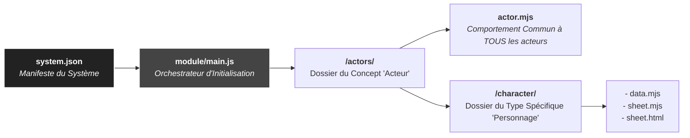

# Système de Jeu "Guildes : El Dorado" pour Foundry VTT

Ce dépôt contient le code source du système de jeu pour le jeu de rôle **Guildes : El Dorado**, développé pour Foundry Virtual Tabletop (v13+).

## 🏛️ Architecture du Système

Ce système adopte une architecture modulaire et orientée concept. La structure est conçue pour être lue de manière hiérarchique, du point d'entrée général aux implémentations spécifiques.

Le diagramme ci-dessous illustre cette hiérarchie.

### Logique de la Hiérarchie

1.  **`system.json` (Le Manifeste)**
    *   C'est la racine du projet. Il identifie le système et désigne `module/main.js` comme son unique point d'entrée logique.

2.  **`module/main.js` (L'Orchestrateur)**
    *   Ce fichier est le chef d'orchestre. Il est appelé par Foundry et a pour mission de charger et d'enregistrer tous les concepts du système (Acteurs, Objets, etc.).

3.  **`/actors/` (Le Concept "Acteur")**
    *   Ce dossier regroupe tout le code relatif aux acteurs. Sa structure interne sépare le code partagé du code spécifique.
    *   **`actor.mjs`**: Ce fichier définit le **comportement commun** (les fonctions de base) qui sera partagé par **tous** les types d'acteurs.
    *   **`/character/`**: C'est un dossier d'implémentation **spécifique**. Chaque type d'acteur (personnage, pnj, créature...) aura son propre dossier.

4.  **Contenu d'un Type Spécifique (ex: `/character/`)**
    *   Ce dossier est autonome et contient les trois facettes d'un type d'acteur : ses **données** (`data.mjs`), la **logique** de sa fiche (`sheet.mjs`), et son **apparence** (`sheet.html`).

Ce modèle garantit que pour ajouter un nouveau type d'acteur, il suffit de créer un nouveau dossier d'implémentation (ex: `/pnj/`) sur le modèle de `/character/`, sans perturber le reste de la structure.

## 🤝 Contribution

Les contributions, rapports de bugs et suggestions sont les bienvenus. Veuillez ouvrir une "Issue" sur ce dépôt GitHub pour toute discussion.

## 📜 Licence

Ce projet est distribué sous la licence MIT. Voir le fichier `LICENSE` pour plus de détails.
